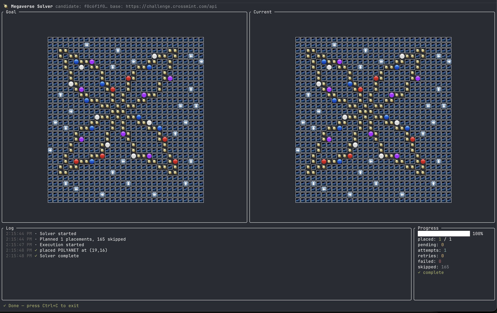

# Megaverse

> A TypeScript monorepo that solves the [Crossmint Megaverse coding challenge](https://challenge.crossmint.com/).
> It includes a reusable solver engine, an Ink-based terminal UI, shared TypeBox
> schemas, and a local Elysia server that emulates the Crossmint API for offline work.

The challenge asks you to populate a 2D grid with 🪐 polyanets, 🌙 soloons,
and ☄ comeths by calling a REST API. This repo solves it with a plan-then-execute
flow: fetch goal and current grids, diff them, show the plan in the TUI, then
execute writes only after confirmation.



## Quick Start

```sh
pnpm install
pnpm run server
```

In another terminal:

```sh
CANDIDATE_ID=phase2 \
  MEGAVERSE_BASE_URL=http://localhost:3001/api \
  pnpm run cli
```

Press `Enter` or `Space` to execute the plan. Press `Ctrl+C` to exit.

## Run Against Crossmint

```sh
CANDIDATE_ID=<your-candidate-id> pnpm run cli
```

If `MEGAVERSE_BASE_URL` is unset, the CLI uses `https://challenge.crossmint.com/api`.

## Scripts

| Script | What it does |
| --- | --- |
| `pnpm run cli` | Run the Ink TUI against `MEGAVERSE_BASE_URL` or the default Crossmint API. |
| `pnpm run cli:mock` | Runs the same CLI script but sets `MEGAVERSE_MOCK=1`. This is currently equivalent to `cli` because `MEGAVERSE_MOCK` is not read anywhere. |
| `pnpm run server` | Start the local reference server on `http://localhost:3001`. OpenAPI UI is served at `http://localhost:3001/openapi`. |
| `pnpm run test` | Run recursive package tests. Right now only `@megaverse/engine` defines a test script. |
| `pnpm run typecheck` | Run recursive package typechecks. |

## Environment Variables

| Variable | Required | Default | Notes |
| --- | --- | --- | --- |
| `CANDIDATE_ID` | Yes | — | Crossmint candidate ID for the real API, or a scenario ID for the local reference server. |
| `MEGAVERSE_BASE_URL` | No | `https://challenge.crossmint.com/api` | Override the API base URL. Use `http://localhost:3001/api` for the local server. |
| `MEGAVERSE_MOCK` | No | unset | No-op. Set by `pnpm run cli:mock`, but the CLI never reads it. |

## Local Scenarios

When the CLI points at the reference server, `CANDIDATE_ID` selects a scenario:

| ID | Size | Description |
| --- | --- | --- |
| `single` | 3x3 | One polyanet; smoke test. |
| `x-cross` | 11x11 | Phase 1 X-cross. |
| `phase2` | 30x30 | Phase 2 mixed-entity map. |
| `rainbow` | 7x9 | Repeating soloon rainbow that exercises all four colors. |
| `compass` | 9x9 | Central polyanet with comeths on each axis. |
| `mosaic` | 10x10 | Mixed entities with a partial starting state to exercise diffing. |

Unknown scenario IDs fall back to `x-cross`. The reference server keeps one in-memory
grid per `CANDIDATE_ID`; restarting the server resets that state.

## Prerequisites

- Node.js. The repo does not pin a Node version, so use a recent Node release with ESM and top-level `await` support.
- `pnpm@10.33.0`, as pinned in the root `packageManager` field.

## Packages

| Package | Role |
| --- | --- |
| `@megaverse/core` | Shared cell tokens, TypeBox schemas, wire payloads, conversion helpers, and grid types. |
| `@megaverse/engine` | `MegaverseClient`, `Solver`, and progress-tracking interfaces. |
| `@megaverse/cli` | Ink + React terminal UI that plans on mount and executes after confirmation. |
| `@megaverse/reference-server` | Local Elysia implementation of the Megaverse API with scenario-backed in-memory state. |

## How It Works

The solver has two phases:

1. Plan: fetch `/map/:candidateId/goal` and `/map/:candidateId`, diff the grids, skip already-correct cells, and build a placement list.
2. Execute: run placement workers with bounded concurrency and retry failed writes using exponential backoff with jitter.

For component diagrams, tracker internals, retry/backoff math, and reference-server
state flow, see [docs/architecture.md](docs/architecture.md).

## Known Limitations

- The planner is additive. `MegaverseClient` exposes delete methods and the reference server implements delete routes, but `Solver.computePlan()` only schedules placements for non-`SPACE` goal cells.
- `MEGAVERSE_MOCK` is dead code today. The script exists; the CLI does not read that env var.
- The local reference server hardcodes `phase: 1` in current-map responses, even for `phase2`.
- `TuiProgressTracker` counts `failed` by failed attempt, not by distinct cell.
- The local reference server is in-memory only; restarting it resets scenario progress.

## Notes & API Quirks

The [notes/](notes/) directory is the original discovery log for the challenge.
It includes useful API observations, including the richer shape returned by
`GET /api/map/:candidateId`.

## License

MIT — see [LICENSE](LICENSE).
