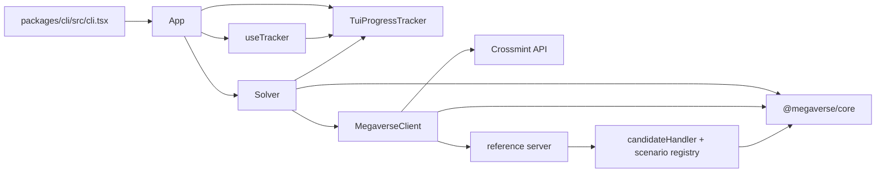
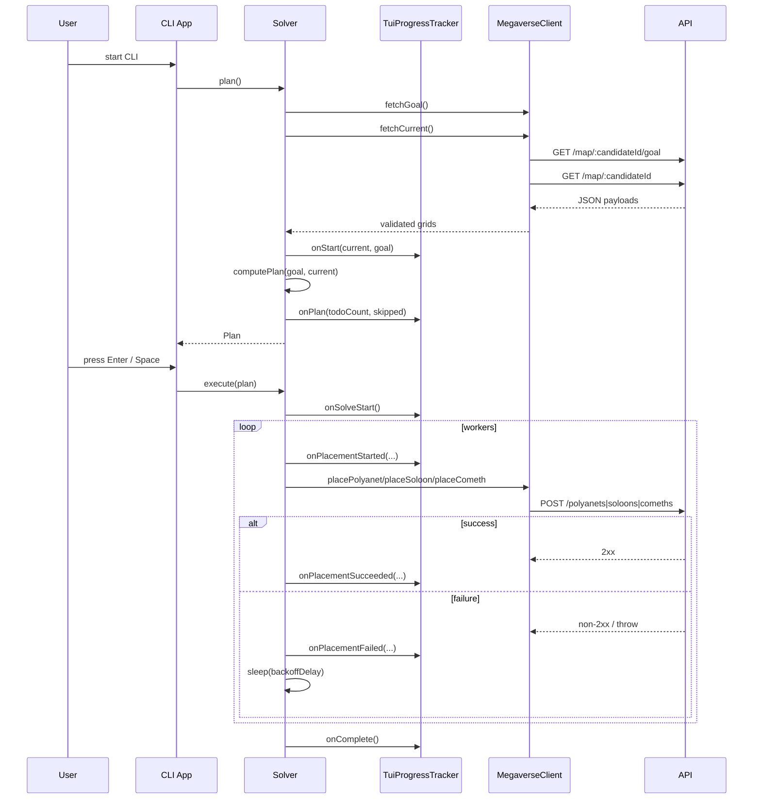
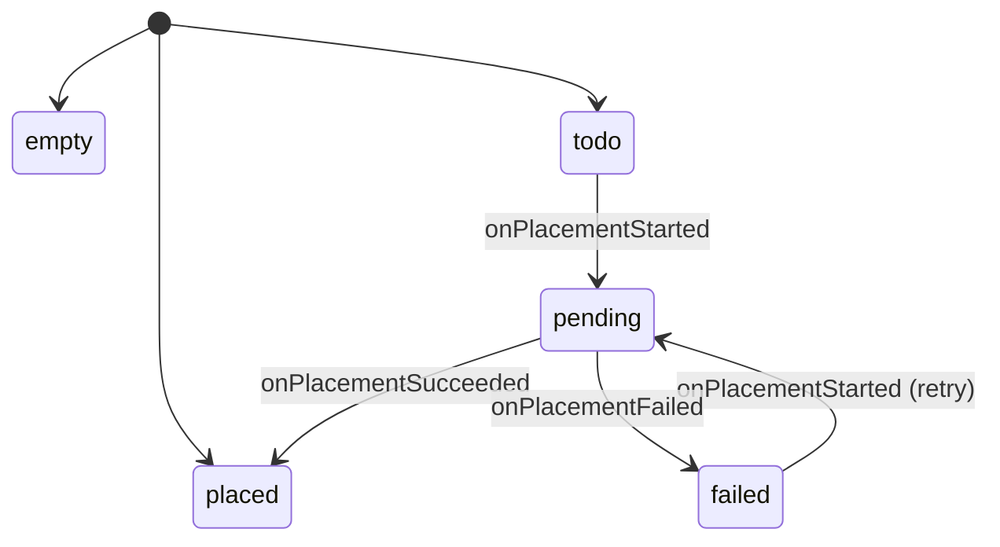
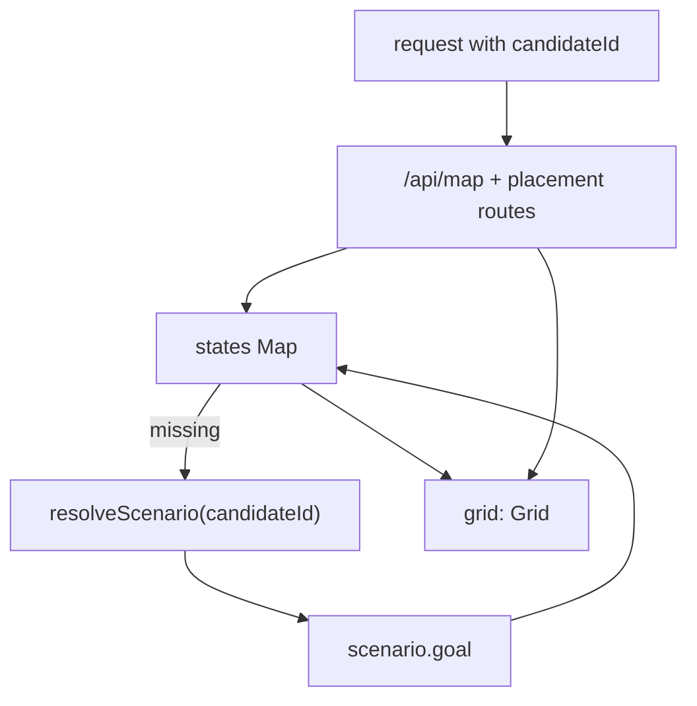

# Architecture

This document is the contributor-facing companion to the root README. It focuses
on how the packages fit together, how the tracker and solver behave, and how the
reference server models state.

## Component Overview



## Package Responsibilities

| Package | Responsibility |
| --- | --- |
| `@megaverse/core` | Cell constants, grid types, TypeBox schemas, request/response payloads, and conversions between internal cells and server cells. |
| `@megaverse/engine` | The API client plus the solver/planner. This is where retry behavior, concurrency, and the progress interface live. |
| `@megaverse/cli` | The interactive entrypoint. It creates the client, tracker, and solver, then renders state with Ink. |
| `@megaverse/reference-server` | A local Elysia server that exposes `/api/*` routes compatible with the client, backed by hand-authored scenario grids and per-candidate in-memory state. |

## Planning and Execution Sequence



## Class Relationships

- `cli.tsx` reads `CANDIDATE_ID` and `MEGAVERSE_BASE_URL`, creates a `MegaverseClient`, and renders `<App />`.
- `App` creates exactly one `TuiProgressTracker` and one `Solver`.
- `App` calls `solver.plan()` on mount, saves the resulting `Plan`, and waits for explicit user input before calling `solver.execute(plan)`.
- `useTracker` subscribes to `TuiProgressTracker` via `useSyncExternalStore`, so tracker updates become React renders.
- `MegaverseClient` is a thin transport layer. It handles URL construction, request bodies, and TypeBox validation for read responses.
- `Solver` is the orchestrator. It plans placements, fans work out across workers, applies retry logic, and emits progress events.

One easy detail to get wrong: the `Solver` constructor is positional and ordered as:

```ts
new Solver(client, tracker, retryOptions, concurrency)
```

`concurrency` is not part of `retryOptions`.

## Progress Tracker Lifecycle

`TuiProgressTracker` maintains a single mutable `TuiState`:

- `goal`: the goal grid fetched during planning
- `grid`: the current grid shown in the UI
- `cellStates`: `Map<"row,col", CellRenderState>`
- `stats`: aggregate counters
- `log`: recent log entries
- `complete`: completion flag

`LOG_LIMIT` is `12`.

### Cell-State Flow



Tracker callbacks mutate state like this:

- `onStart(initial, goal)` seeds `goal`, clones `initial` into `grid`, and classifies each goal cell as `empty`, `placed`, or `todo`.
- `onPlan(total, skipped)` stores totals and calculates `todo = total - skipped`.
- `onSolveStart()` appends a log entry.
- `onPlacementStarted()` marks the cell `pending` and increments `retries` when `attempt > 1`.
- `onPlacementSucceeded()` clones the grid, writes the placed cell, marks it `placed`, decrements `pending`, decrements `todo`, increments `placed`, and increments `attempts`.
- `onPlacementFailed()` marks the cell `failed`, decrements `pending`, increments `failed`, and increments `attempts`.
- `onComplete()` marks execution complete and appends the final log line.

Two details matter for contributors:

- `attempts` increments when an attempt resolves, not when it starts.
- `failed` is attempt-based, not cell-based. A retry that later succeeds still increments `failed` for each failed attempt.

## Retry and Backoff Mechanics

Engine defaults from `packages/engine/src/lib/solver.ts`:

| Setting | Default |
| --- | --- |
| `maxAttempts` | `5` |
| `baseDelayMs` | `500` |
| `maxDelayMs` | `8000` |
| `concurrency` | `4` |

CLI overrides from `packages/cli/src/tui/app.tsx`:

| Setting | CLI value |
| --- | --- |
| `maxAttempts` | `10` |
| `baseDelayMs` | `1000` |
| `maxDelayMs` | `20000` |
| `concurrency` | `3` |

Retries happen inside `placeWithRetry`:

1. emit `onPlacementStarted`
2. call the appropriate client method
3. on success: emit `onPlacementSucceeded` and stop
4. on failure: emit `onPlacementFailed`
5. stop retrying if:
   - this was the last attempt, or
   - `shouldRetry(err)` returned `false`
6. otherwise sleep before the next attempt

The backoff formula is:

```ts
Math.random() * Math.min(maxDelayMs, baseDelayMs * 2 ** (attempt - 1))
```

This is exponential backoff with full jitter. The exponential window is capped by
`maxDelayMs`, and the actual sleep is randomized between `0` and that capped window.

The planner is additive. It only generates placements for non-`SPACE` goal cells.
Delete endpoints exist on both the client and the mock server, but the planner
does not schedule delete operations.

## Reference Server State Model



The reference server keeps one `CandidateState` per `candidateId`.

- State is created lazily on the first request for that ID.
- `resolveScenario(candidateId)` returns a scenario or falls back to `x-cross`.
- If a scenario defines `startingCurrent`, the server converts that grid into raw `ServerCell` values.
- Otherwise it allocates an empty grid with the same dimensions as the goal.
- Placement routes mutate the current grid in place.
- Goal routes read from the scenario; current-map routes read from the mutable grid.

Current-map responses hardcode `phase: 1`, even for the `phase2` scenario.

## API and Mock-Server Quirks

- `GET /api/map/:candidateId` returns a richer current-map shape than the challenge docs imply, and the client depends on that shape.
- The mock server exposes the same write surface the client uses:
  - `POST /api/polyanets`
  - `POST /api/soloons`
  - `POST /api/comeths`
  - `DELETE /api/polyanets`
  - `DELETE /api/soloons`
  - `DELETE /api/comeths`
- The client has delete methods, but the solver does not invoke them during planning or execution.
